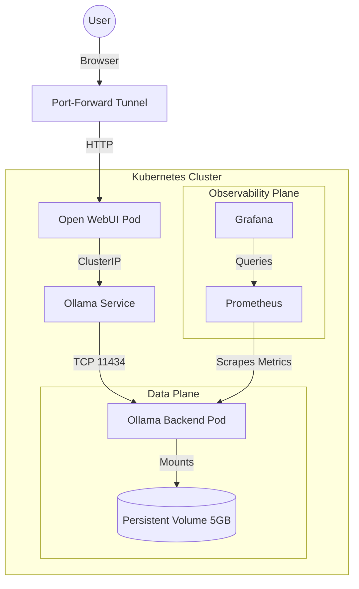

# Local K8s LLMOps Platform: Self-Hosted AI with SRE Observability


## 📖 Introduction
This project demonstrates a production-grade implementation of a **Generative AI Platform** running locally on Kubernetes (Minikube). 

Unlike standard deployments, this project focuses on **LLMOps** and **Site Reliability Engineering (SRE)** principles. It solves the challenge of running resource-intensive AI models (Microsoft Phi-3) on constrained hardware (8GB RAM) by implementing:

* **Capacity Planning:** "Right-Sized" node allocation (4 CPU / 6GB RAM) to prevent OOM kills.
* **Efficient Storage:** Custom Init Containers to manage large model weights (`.gguf`) via Persistent Volumes, keeping Docker images lightweight.
* **Deep Observability:** A full Prometheus/Grafana stack to visualize inference latency (~83s on CPU) and CPU saturation in real-time.

---

## 🏗️ Architecture



## 🛠️ Prerequisites

* Docker installed
* Minikube installed
* Kubectl installed
* Helm installed

## 🚀 Installation Guide

### 1. Infrastructure Provisioning

Start the cluster with specific resource limits to accommodate the LLM without crashing the host OS.

```bash
minikube start --cpus 4 --memory 6144
```

### 2. Deploy the AI Backend (Ollama)

Deploy the storage and the inference engine. The Init Container will automatically download the Phi-3 model (approx. 1.6GB) to the Persistent Volume.

```bash
kubectl apply -f ollama-pvc.yaml
kubectl apply -f ollama-pod.yaml
```

Wait for the pod status to change from `Init:0/1` to `Running`.

### 3. Deploy Networking & Frontend

Set up the internal ClusterIP service and the Open WebUI interface.

```bash
kubectl apply -f ollama-service.yaml
kubectl apply -f webui-pod.yaml
```

### 4. Install SRE Observability Stack

Deploy Prometheus and Grafana using Helm.

```bash
helm repo add prometheus-community [https://prometheus-community.github.io/helm-charts](https://prometheus-community.github.io/helm-charts)
helm repo update
helm install monitoring-stack prometheus-community/kube-prometheus-stack --namespace monitoring --create-namespace
```

## 💻 Usage

### Access the Chat Interface

Open a tunnel to the frontend service:

```bash
kubectl port-forward webui-pod 8080:8080
```

URL: http://localhost:8080

### Access Grafana Dashboards

Retrieve the admin password and open a tunnel:

```bash
# Get Password
kubectl get secret --namespace monitoring monitoring-stack-grafana -o jsonpath="{.data.admin-password}" | base64 --decode ; echo

# Open Tunnel
kubectl port-forward --namespace monitoring svc/monitoring-stack-grafana 3000:80
```

URL: http://localhost:3000

## 📊 SRE Insights

* **Latency:** Average inference time on CPU is ~83 seconds. Future improvements would involve GPU node groups (AWS g4dn).
* **Resources:** Idle memory usage is ~4GB. Active inference spikes CPU usage to 4 cores.

